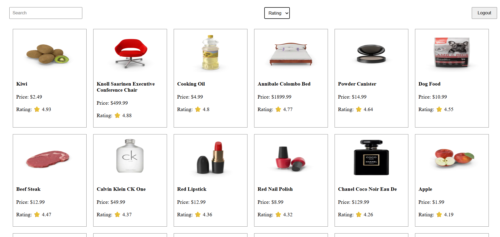

# 🛍️ Product Viewer - React.js Assignment

A responsive React.js application that allows users to log in using DummyJSON credentials and view a list of products. It features authentication, protected routes, search, sorting, and responsive design.

---

## 🔐 Test Login Credentials

```json
{
  "username": "emilys",
  "password": "emilyspass"
}
````

---

## ✨ Features

* Login using DummyJSON API
* Store and use JWT token
* Protected routes (only accessible after login)
* Product listing with image, title, price, rating
* Search products by name
* Sort products by price, rating, or name
* Logout functionality
* Toast notifications for errors/success
* Responsive layout using Tailwind CSS

---

## 🛠️ Tech Stack

* React.js (18+)
* React Router
* Axios
* Tailwind CSS
* DummyJSON API

---

## 📁 Folder Structure

```
src/
│
├── assets/              # Optional: images, icons
├── components/          # Header, ProductCard, etc.
├── context/             # AuthContext for managing login state
├── pages/               # LoginPage, ProductPage
├── routes/              # ProtectedRoute component
├── services/            # API logic (authService.js, productService.js)
├── App.js               # Main routes and structure
└── index.js             # App entry point
```

---

## 🔗 APIs Used

* **Login:** `POST https://dummyjson.com/auth/login`
* **Products:** `GET https://dummyjson.com/products`

---

## 🌐 .env File

Create a `.env` file in the root with:

```env
REACT_APP_API_BASE=https://dummyjson.com
```

Use it in services like:

```js
const BASE_URL = process.env.REACT_APP_API_BASE;
```

---

## 🚀 Getting Started

1. **Clone the Repo**

```bash
git clone https://github.com/lijubehera/Product-Viewer---React.js-Assignment
cd product-viewer
```

2. **Install Dependencies**

```bash
npm install
```

3. **Setup .env File**

```env
REACT_APP_API_BASE=https://dummyjson.com
```

4. **Start the Development Server**

```bash
npm start
```

Visit: `http://localhost:3000`

---

## 🖼️ Sample UI Ideas

* **Login Page**: Simple form with username & password
* **Dashboard**: Grid layout showing product image, title, price, rating
* **Header**: Logout button, optional search bar and sorting dropdown

---

## 📸 Screenshots (Optional)



## 📄 License

This project is built for learning and demonstration purposes only.

---

## 👨‍💻 Developer

**Narayan Behera**
React.js Developer
GitHub:[(https://github.com/lijubehera)]

